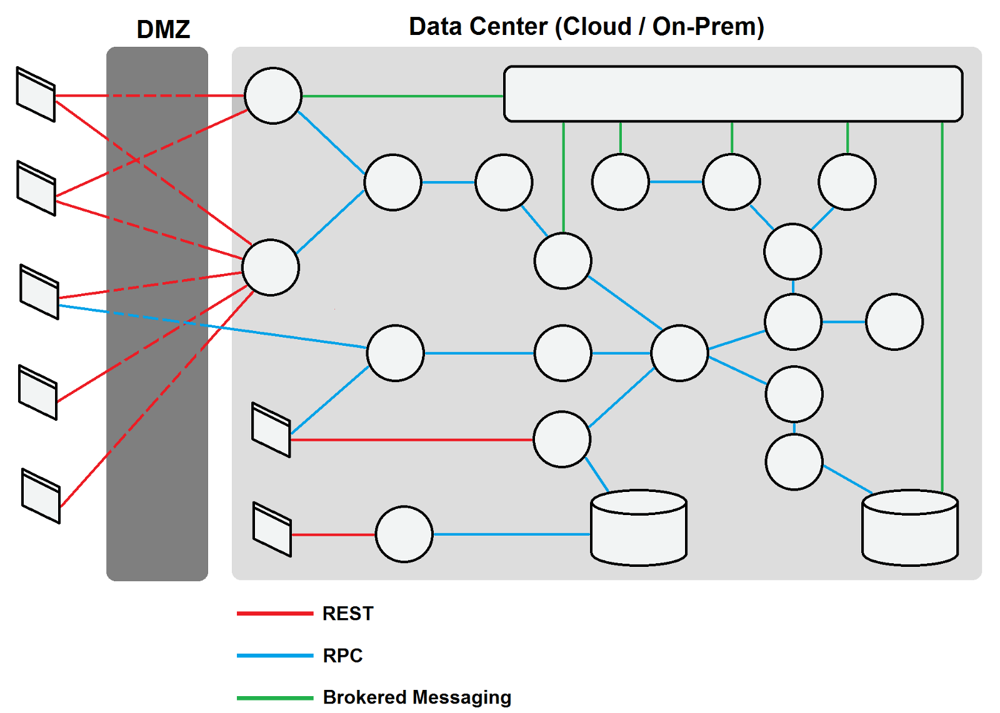

最近在复盘研究去年压测期间出现的一些网络问题时，重新对HTTP和TCP连接进行了深入学习，也对压测期间觉得"诡异"的问题有了新的理解
<!--more-->
### 问题背景
去年压测期间，在微服务架构下，系统某服务由于客户端（其他业务系统
）调用压力较大，导致连接数过多，出现异常。
* **调用方式**: HTTP长连接调用
* **部署环境**: 阿里云 + Docker
* **负载均衡**: 阿里云SLB（7层结构）
* **异常现象**: 服务端连接数过多，出现异常
* **异常处理**: 将客户端调用由长连接改为短连接后，连接数下降，压力得到缓解，异常消失

问题是得到解决了，但问题**为什么能得到解决**却让我百思不得其解。
按理说长连接能复用连接，短连接不能。但在这儿长连接却使连接数过高，短连接却解决了这个问题，颇有一种："老鼠抓了猫"的讽刺。

提出方案的同学的理由是：**在之前的实践中发现短连接确实在压测中有更好的表现**。具体原因也没给出好的解释。大家提出了各种理论，有怀疑是连接泄漏的，还有怀疑是经过的阿里云SLB带来的问题的等等。但到最后还是不了了之，终究没给出令人信服的答案。

几个月之后，我又偶然间想起了这个问题。这一次我决定从头开始，从TCP出发，弄清楚这个"悬案"

### TCP连接
众所周知，采用TCP协议进行网络通信时，在真正的读写操作之前，server与client之间必须建立一个连接，这也是我们常说的**"三次握手"**


#### TCP短连接
让我们先看看短连接的情况：
client向server发起连接请求，server接到请求，然后双方建立连接。client向server发送消息，server回应client，然后一次读写就完成了，这时候双方任何一个都可以发起close操作。短连接一般只会在client/server间传递一次读写操作。

当读写操作完成后，双方不再需要这个连接时，它们就可以释放这个连接。而释放则又需要**四次握手**，所以说每个连接的建立和释放都是需要消耗资源和时间的。

除此之前，tcp主动断开的一方会进入TIME_WAIT状态，并且持续90s-120s不等的时间。尽管Linux设计了一套回收机制来处理这个问题，但在高并发下仍然会出现大量的TIME_WAIT，影响新的连接的建立。

#### TCP长连接

由于我们不希望资源都浪费在频繁建立和释放TCP连接上，这时候TCP长连接的方案便出现了。

当我们使用长连接时，client向server发起连接，server接受client连接，双方建立连接。Client与server完成一次读写之后，**它们之间的连接并不会主动关闭**，后续的读写操作会继续使用这个连接。

那怎么确定等待的时候客户端还存在呢，这时候就需要说一个概念：TCP保活功能。

**保活功能主要为服务器应用提供，服务器应用希望知道客户主机是否崩溃，从而可以代表客户使用资源**。如果客户已经消失，使得服务器上保留一个半开放的连接，而服务器又在等待来自客户端的数据，则服务器将应远等待客户端的数据，保活功能就是试图在服务器端检测到这种半开放的连接。

如果一个给定的连接在两小时内没有任何的动作，则服务器就向客户发一个探测报文段，客户主机必须处于以下4个状态之一：

* 客户主机依然正常运行，并从服务器可达。客户的TCP响应正常，而服务器也知道对方是正常的，服务器在两小时后将保活定时器复位。
* 客户主机已经崩溃，并且关闭或者正在重新启动。在任何一种情况下，客户的TCP都没有响应。服务端将不能收到对探测的响应，并在75秒后超时。服务器总共发送10个这样的探测 ，每个间隔75秒。如果服务器没有收到一个响应，它就认为客户主机已经关闭并终止连接。
* 客户主机崩溃并已经重新启动。服务器将收到一个对其保活探测的响应，这个响应是一个复位，使得服务器终止这个连接。
* 客户机正常运行，但是服务器不可达，这种情况与2类似，TCP能发现的就是没有收到探查的响应。


但从上面可以看出，保持连接后虽然可以使用TCP保活功能探测长连接的存活状况，不过这里存在一个问题，存活功能的探测周期太长，还有就是它只是探测TCP连接的存活，遇到恶意的连接时，就会白白浪费连接资源。

在长连接的应用场景下，client端一般不会主动关闭它们之间的连接，Client与server之间的连接如果一直不关闭的话，会存在一个问题，随着客户端连接越来越多，server早晚有扛不住的时候，这时候server端需要采取一些策略，如关闭一些长时间没有读写事件发生的连接，或者以客户端机器为颗粒度，限制每个客户端的最大长连接数，这样可以避免一些恶意连接导致server端服务受损。

### HTTP长连接
既然TCP长连接有这么多的弊端，那有没有更好的方式复用TCP连接呢？这就要请出我们今天的主角了：HTTP长连接
HTTP长连接看上去和TCP长连接很像，而且功能也很相似，以至于很多同学把它们当做一个东西。其实它们有很大的区别！

**TCP长连接用于探测对端是否存在，而 HTTP长连接用于协商以复用TCP连接**。

太晦涩了？OK，这么解释你就明白了：
**1）**当一个请求结束后，服务端对客户端说：兄弟，我这个通道先不关闭啦，你要传啥数据就继续用这个通道就好啦。
两个小时后，服务端过来问一句：兄弟，你还在么。客户端回答："在着呢"。
又过了两个小时，服务端又过来问一句：兄弟，你还在么。这次客户端没有回答了。这时候服务端就把此次连接关闭了。**这就是TCP长连接**

**2）** 当一个请求结束前，客户端对服务端说：等会我可能不止一个请求啊，第一个完了后你等等我，服务端：好的。客户端于是接连发了好几个请求。再过了一会(idletimeout)，服务端发现客户端没动静了没有新的请求发送，便断掉了这次连接，**这就是HTTP长连接**

现在你明白了吧。即便一个 TCP 连接未启用长连接功能，也不妨碍HTTP层面开启长连接。**它们是两个目的不同的技术，也不存在谁依赖于谁的关系**。


### HTTP连接池
到这里，看上去HTTP长连接已经能满足我们大部分需求了。那我们常见的HTTP连接池又是做什么的呢
从上面长连接的介绍中我们能知道，请求结束后，下一个紧接的请求能复用HTTP长连接。但如果出现下面的情况：
1）短时间内进行大量请求。也就是说，上一次请求还没有结束就发起了新的请求。这时候由于连接已被占用，只能发起新的TCP连接。
2）旧的连接由于过了等待超时时间（idletimeout）被释放，这时候新的连接过来，仍然需要重新经过三次握手创建连接

那HTTP连接池是什么呢？它会帮你维持一定数量的连接。当连接使用完之后，不会释放掉，而是放回连接池中，并帮你保持长连接。这样就算你过了超时时间再请求，从连接池中取出的连接也是能直接使用的。在并发较高的场景下，不但能提前预创建好连接，而且能高效复用连接，避免连接的泄漏。

### Go语言中如何进行HTTP请求

这时候写过Golang的同学可能会问："可是我们平时使用Golang的时候并没有刻意地去使用长连接和连接池呀，也运行得好好的呀" φ(≧ω≦*)♪
是这样的，不过你是否知道，这是因为Golang从语言层面已经支持了HTTP连接池和长连接，而且我们现在使用的HTTP1.1默认使用的就是HTTP长连接。

让我看一次最普通的HTTP请求


```go
package main

import (
	"fmt"
	"io/ioutil"
	"net/http"
)

func main() {
	var c = &http.Client{
		Transport: http.DefaultTransport,
	}
	response, err := c.Get("http://baidu.com")
	if err != nil {
		fmt.Printf("error:%s\n", err)
		return
	}
	// 如果结束时Body不close掉，连接会一直处于ESTABLISHED状态，造成连接泄漏
	defer response.Body.Close()
	// 如果Body数据不全部读取掉，会造成TCP连接无法复用，每次新建连接
	ioutil.ReadAll(response.Body)
	
	
}
```
我们创建了一个client，使用了默认的Transport，然后进行了一次HTTP请求。看上去平淡无奇，其实每一步都"暗藏玄机"
Transport可以理解为一个连接池。我们先看看系统默认的Transport，也就是DefaultTransport

```go
// DefaultTransport is the default implementation of Transport and is
// used by DefaultClient. It establishes network connections as needed
// and caches them for reuse by subsequent calls. It uses HTTP proxies
// as directed by the $HTTP_PROXY and $NO_PROXY (or $http_proxy and
// $no_proxy) environment variables.
var DefaultTransport RoundTripper = &Transport{
	Proxy: ProxyFromEnvironment,
	DialContext: (&net.Dialer{
		Timeout:   30 * time.Second,
		KeepAlive: 30 * time.Second,
		DualStack: true,
	}).DialContext,
	// 最多维持100个空闲连接
	MaxIdleConns:          100,
	// 每个连接有90秒的等待时间
	IdleConnTimeout:       90 * time.Second,
	TLSHandshakeTimeout:   10 * time.Second,
	ExpectContinueTimeout: 1 * time.Second,
}

```
先说最重要的一点：**一般情况下，一个服务使用一个Transport即可**。每次请求时都实例化一个Transport会造成大量浪费，并且会造成连接不能复用。
DefaultTransport会帮你维持100个空闲连接，每个连接有90秒的等待时间。而且yo由于没有设置DisableKeepAlives参数，所以默认开启了HTTP长连接。
如果需要自定义，可以新建Transport对象，设定你要改的值即可。（注意，没有设定的值，大多默认为**无限制**）


当请求结束后，接下里的两个动作也很重要

```go
response, err := c.Get("http://baidu.com")
if err != nil {
   fmt.Printf("error:%s\n", err)
   return
}
defer response.Body.Close()
ioutil.ReadAll(response.Body)
```
为什么说这两个动作很重要呢，因为这关系到HTTP的复用问题。

我们先看一下Golang官方对Body的注释


> The http Client and Transport guarantee that Body is always
> non-nil, even on responses without a body or responses with
> a zero-length body. It is the caller's responsibility 
> close Body. The default HTTP client's Transport may not
> reuse HTTP/1.x "keep-alive" TCP connections if the Body is
> not read to completion and closed.

也就是说，response.Body的关闭是调用者的责任。如果结束时Body不close掉，连接会一直处于ESTABLISHED状态，造成连接泄漏。而如果Body数据不全部读取掉，会造成TCP连接无法复用，每次新建连接


### 再看问题
现在我们可以回头看看之前讨论的问题了。
现在来看，长连接改为短连接，问题解决的现象，似乎能够说通了。
如果长连接的参数设定不太合理时，当客户端使用长连接大量并发请求时，由于来不及复用，很快连接被大量占据。又由于HTTP长连接和连接池的维持，连接一直居高不下。而短连接由于能够立即释放，反而使资源更有效的利用

### 更好的方案？
那有没有更好的方式呢？当然有

这是一张经典的微服务架构图，可以看到：
* 用户和前台通过HTTP进行通信
* 系统前，中，后台间通过RPC进行通信
* 系统与数据中心通过消息队列通信
### 总结

* TCP长连接和HTTP长连接是两种不同的技术，也不存在依赖关系
* TCP长连接用于探测对端是否存在，而 HTTP长连接用于协商以复用TCP连接
* HTTP连接池能帮你维持一定数量的连接，提高连接复用的效率。
* 使用HTTP短连接可能会造成出现大量TIME-WAIT的情况，而滥用HTTP长连接也可能出现连接被占用短缺的情况。所以并不是长连接一定比短连接好，需要根据实际的情况具体分析。
* 微服务系统间调用更适合的方式是效率更高的RPC调用


