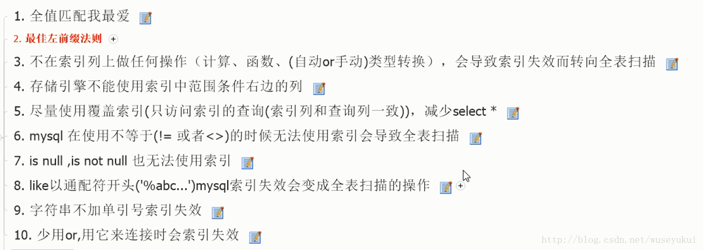
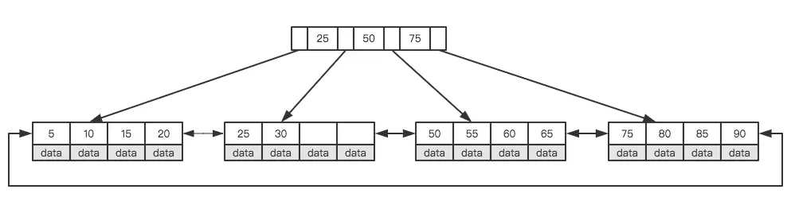

### MyISAM VS  InnoDB

1.　　InnoDB 引擎  
　　　MySQL 5.5 及以后版本中的默认存储引擎，它的优点如下：灾难恢复性好，支持事务，使用行级锁，支持外键关联，支持热备份。  
　　　InnoDB引擎中的表，其数据的物理组织形式是簇表（Cluster Table），主键索引和数据是在一起的，数据按主键的顺序物理分布。实现了缓冲管理，不仅能缓冲索引也能缓冲数据，并且会自动创建散列索引以加快数据的获取。

2.　　MyISAM引擎  
　　　它的特性如下：不支持事务；使用表级锁，并发性差；主机宕机后，MyISAM表易损坏，灾难恢复性不佳；可以配合锁，实现操作系统下的复制备份、迁移；只缓存索引，数据的缓存是利用操作系统缓冲区来实现的。可能引发过多的系统调用且效率不佳；数据紧凑存储，因此可获得更小的索引和更快的全表扫描性能。

上面这两个是最常用的Mysql引擎。它们两者的主要区别：InnoDB支持事务，MyISAM不支持；MyISAM适合查询以及插入为主的应用，InnoDB适合频繁修改以及涉及到安全性较高的应用；InnoDB支持外键，MyISAM不支持；清空整个表时，InnoDB是一行一行的删除，效率非常慢。MyISAM则会重建表；InnoDB支持行锁，MyISAM的全表锁；InnoDB中不保存表的行数，如select count\(\*\) from table时，InnoDB需要扫描一遍整个表来计算有多少行，但是MyISAM只要简单的读出保存好的行数即可。注意的是，当count\(\*\)语句包含where条件时MyISAM也需要扫描整个表。

总之：MyISAM的索引方式也叫做“非聚集”的。MyISAM类型不支持事务处理等高级处理，而InnoDB类型支持；MyISAM类型的表强调的是性能，其执行速度比InnoDB类型更快，但是不提供事务支持，而InnoDB提供事务支持已经外部键等高级数据库功能。

### 推荐阅读:

[https://blog.codinglabs.org/articles/theory-of-mysql-index.html](https://blog.codinglabs.org/articles/theory-of-mysql-index.html)

### 索引

#### 聚集索引 和非聚集索引

* 就是以主键创建的索引
* 非聚集索引就是以非主键创建的索引
* 聚集索引在叶子节点存储的是表中的数据
* 非聚集索引在叶子节点存储的是主键和索引列

#### 原理

* 使用非聚集索引查询出数据时，拿到叶子上的主键再去查到想要查找的数据。\(拿到主键再查找这个过程叫做回表\)
* 在创建多列索引中也涉及到了一种特殊的索引-- 覆盖索引
* 如果不是聚集索引，叶子节点存储的是主键+列值，最终还是要“回表”，也就是要通过主键再查找一次。这样就会比较慢
* 覆盖索引就是把要查询出的列和索引是对应的，不做回表操作

#### 最佳实践

* 原则上优先选择区分度高的字段作为索引字段，组合索引中原则上区分度高的字段放在前面
* 最左前缀匹配原则。这是非常重要、非常重要、非常重要（重要的事情说三遍）的原则，MySQL会一直向右匹配直到遇到范围查询（&gt;,&lt;,BETWEEN,LIKE）就停止匹配。
* 尽量选择区分度高的列作为索引，区分度的公式是 COUNT\(DISTINCT col\) / COUNT\(\*\)。表示字段不重复的比率，比率越大我们扫描的记录数就越少。
* 索引列不能参与计算，尽量保持列“干净”。比如，FROM\_UNIXTIME\(create\_time\) = '2016-06-06' 就不能使用索引，原因很简单，B+树中存储的都是数据表中的字段值，但是进行检索时，需要把所有元素都应用函数才能比较，显然这样的代价太大。所以语句要写成 ： create\_time = UNIX\_TIMESTAMP\('2016-06-06'\)
* 尽可能的扩展索引，不要新建立索引。比如表中已经有了a的索引，现在要加（a,b）的索引，那么只需要修改原来的索引即可。
* 单个多列组合索引和多个单列索引的检索查询效果不同，因为在执行SQL时，MySQL只能使用一个索引，会从多个单列索引中选择一个限制最为严格的索引。

### 锁

* 对于UPDATE、DELETE、INSERT语句，InnoDB会自动给涉及数据集加排他锁（X\)
* MyISAM在执行查询语句SELECT前，会自动给涉及的所有表加读锁，在执行更新操作（UPDATE、DELETE、INSERT等）前，会自动给涉及的表加写锁，这个过程并不需要用户干预
* 乐观锁是一种思想，具体实现是，表中有一个版本字段，第一次读的时候，获取到这个字段。处理完业务逻辑开始更新的时候，需要再次查看该字段的值是否和第一次的一样。如果一样更新，反之拒绝。之所以叫乐观，因为这个模式没有从数据库加锁，等到更新的时候再判断是否可以更新。select for updae 宕机会自动释放
* 悲观锁是数据库层面加锁，都会阻塞去等待锁。 select for update share

### SQL小贴士

#### 隐式转换

有关联的字段，数据类型、字符集保持一致，防止出现隐式转换  
举例（均有order\_id单独的索引）：  
1、order表中，order\_id为utf8  
2、order\_detail表中，order\_id为utf8mb4

SQL：  
select \* from order as o inner join order\_detail as od on o.order\_id = od.order\_id where od.order\_id = ‘KNR5110867275558’; \#执行时间400ms（约30w数据），order表不走索引

原因：不同字符集或类型，可能触发隐式转换，导致无法走索引

#### GROUP BY

使用 GROUP BY时，如非必要，后跟ORDER BY NULL  
原因：使用group by时，默认会将得到的结果根据分类字段进行排序

改造前SQL：  
select buyer\_id,count\(\*\) as num from order where showcase\_id = 999999997 and state = ‘TRADE\_CLOSED’ group by buyer\_id; \#1s,由于默认将结果按照buyer\_id排序，导致有文件排序

改造后SQL：  
select buyer\_id,count\(\*\) as num from order where showcase\_id = 999999997 and state = ‘TRADE\_CLOSED’ group by buyer\_id order by null; \#800ms，显式声明不排序，无文件排序

补充说明：正常情况下，性能提升不大，但是没有了文件排序。

#### 延时关联

使用limit分页时，使用分页模式（延迟关联）写法

改造前SQL：select \* from order where showcase\_id = 10008 and ctime &gt;= ‘2018-01-01’ and ctime &lt; ‘2018-04-01’ order by ctime desc limit 100000,20; \#700ms

改造后SQL：select o.\* from order as o inner join \(select id from order where showcase\_id = 10008 and ctime &gt;= ‘2018-01-01’ and ctime &lt; ‘2018-04-01’ order by ctime desc limit 100000,20\) as b on o.id = b.id; \#170ms

原因：limit会逐条扫描，使用延迟关联可以仅扫描索引，而不需要回表扫描

#### 大偏移量查询

偏移量巨大的查询，若无固定条数要求，可采用ID范围分批查询。

1、查询最大最小ID  
select id from order where showcase\_id = 10008 order by id asc limit 1  
select id from order where showcase\_id = 10008 order by id desc limit 1

2、每次查询ID范围为n的数据

select _ from order where showcase\_id = 10008 and id &gt;= 18 and id &lt; 1018  
select _ from order where showcase\_id = 10008 and id &gt;= 1018 and id &lt; 2018

#### 独立索引

若某字段查询比重大，除建立联合索引，可为该字段单独创建索引，不但可以减少扫描数据量，而且根据id排序时，可以直接走索引，避免文件排序

#### 其他

* 除分页外，排序尽量由程序完成
* 若无必要，使用inner join，而不用left join

## 索引失效与优化

来源：[https://blog.csdn.net/wuseyukui/article/details/72312574](https://blog.csdn.net/wuseyukui/article/details/72312574)

## orderby索引优化

①MySQL支持两种方式的排序filesort和index，Using index是指MySQL扫描索引本身完成排序。index效率高，filesort效率低。

②order by满足两种情况会使用Using index。

* 1.order by语句使用索引最左前列。

* 2.使用where子句与order by子句条件列组合满足索引最左前列。

③尽量在索引列上完成排序，遵循索引建立（索引创建的顺序）时的最佳左前缀法则。

④如果order by的条件不在索引列上，就会产生Using filesort。

[https://www.cnblogs.com/developer\_chan/p/9225638.html](https://www.cnblogs.com/developer_chan/p/9225638.html)

## 底层原理

平衡二叉树首先需要符合二叉查找树的定义，其次必须满足任何节点的两个子树的高度差不能大于1。显然图②不满足平衡二叉树的定义，而图①是一课平衡二叉树。平衡二叉树的查找性能是比较高的（性能最好的是最优二叉树），查询性能越好，维护的成本就越大。比如图①的平衡二叉树，当用户需要插入一个新的值9的节点时，就需要做出如下变动。

通过一次左旋操作就将插入后的树重新变为平衡二叉树是最简单的情况了，实际应用场景中可能需要旋转多次。至此我们可以考虑一个问题，平衡二叉树的查找效率还不错，实现也非常简单，相应的维护成本还能接受，为什么MySQL索引不直接使用平衡二叉树？

随着数据库中数据的增加，索引本身大小随之增加，不可能全部存储在内存中，因此索引往往以索引文件的形式存储的磁盘上。这样的话，索引查找过程中就要产生磁盘I/O消耗，相对于内存存取，I/O存取的消耗要高几个数量级。可以想象一下一棵几百万节点的二叉树的深度是多少？如果将这么大深度的一颗二叉树放磁盘上，每读取一个节点，需要一次磁盘的I/O读取，整个查找的耗时显然是不能够接受的。那么如何减少查找过程中的I/O存取次数？

一种行之有效的解决方法是减少树的深度，将二叉树变为m叉树（多路搜索树），而`B+Tree`就是一种多路搜索树。理解`B+Tree`时，只需要理解其最重要的两个特征即可：第一，所有的关键字（可以理解为数据）都存储在叶子节点（`Leaf Page`），非叶子节点（`Index Page`）并不存储真正的数据，所有记录节点都是按键值大小顺序存放在同一层叶子节点上。其次，所有的叶子节点由指针连接。如下图为高度为2的简化了的`B+Tree`。

简化B+Tree

怎么理解这两个特征？MySQL将每个节点的大小设置为一个页的整数倍（原因下文会介绍），也就是在节点空间大小一定的情况下，每个节点可以存储更多的内结点，这样每个结点能索引的范围更大更精确。所有的叶子节点使用指针链接的好处是可以进行区间访问，比如上图中，如果查找大于20而小于30的记录，只需要找到节点20，就可以遍历指针依次找到25、30。如果没有链接指针的话，就无法进行区间查找。这也是MySQL使用`B+Tree`作为索引存储结构的重要原因。

