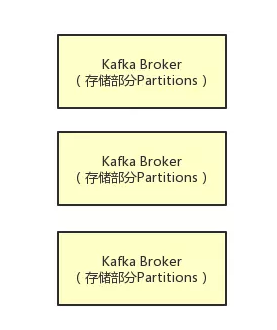
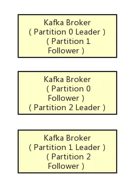
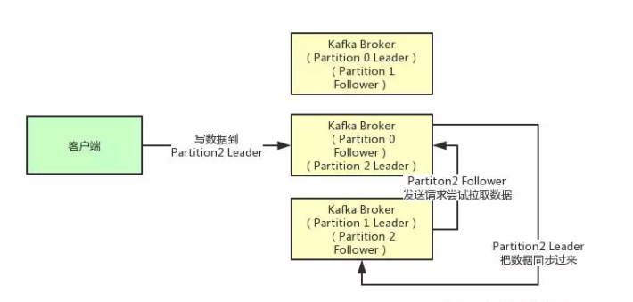
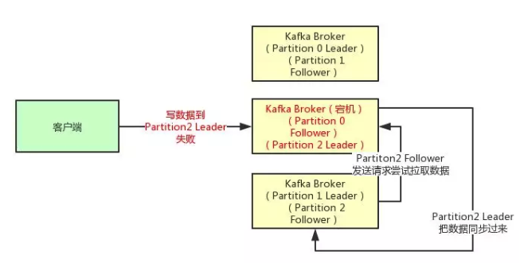
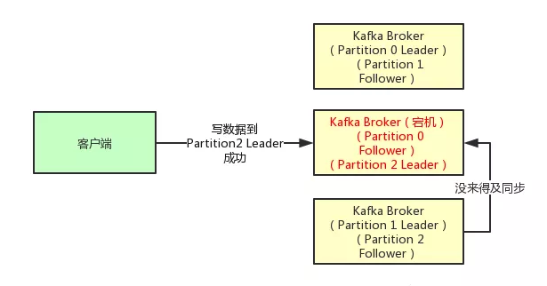
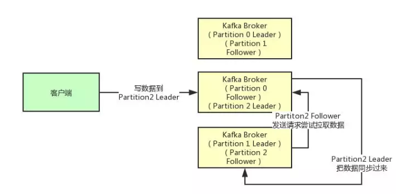

Kafka持久化原理介绍
<!--more-->

### 生产者数据完整性

#### 1. 如何保证宕机的时候数据不丢失
如果要想理解这个acks参数的含义，首先就得搞明白kafka的高可用架构原理。

比如下面的图里就是表明了对于每一个Topic，我们都可以设置他包含几个Partition，每个Partition负责存储这个Topic一部分的数据。

然后Kafka的Broker集群中，每台机器上都存储了一些Partition，也就存放了Topic的一部分数据，这样就实现了Topic的数据分布式存储在一个Broker集群上。

但是有一个问题，万一 一个Kafka Broker宕机了，此时上面存储的数据不就丢失了吗？

没错，这就是一个比较大的问题了，分布式系统的数据丢失问题，是他首先必须要解决的，一旦说任何一台机器宕机，此时就会导致数据的丢失。

#### 2. 多副本冗余的高可用机制

所以如果大家去分析任何一个分布式系统的原理，比如说zookeeper、kafka、redis cluster、elasticsearch、hdfs，等等，其实他都有自己内部的一套多副本冗余的机制，多副本冗余几乎是现在任何一个优秀的分布式系统都一般要具备的功能。

在kafka集群中，每个Partition都有多个副本，其中一个副本叫做leader，其他的副本叫做follower，如下图

如上图所示，假设一个Topic拆分为了3个Partition，分别是Partition0，Partiton1，Partition2，此时每个Partition都有2个副本。

比如Partition0有一个副本是Leader，另外一个副本是Follower，Leader和Follower两个副本是分布在不同机器上的。

这样的多副本冗余机制，可以保证任何一台机器挂掉，都不会导致数据彻底丢失，因为起码还是有副本在别的机器上的。

#### 3. 多副本之间数据如何同步

接着我们就来看看多个副本之间数据是如何同步的？其实任何一个Partition，只有Leader是对外提供读写服务的

也就是说，如果有一个客户端往一个Partition写入数据，此时一般就是写入这个Partition的Leader副本。

然后Leader副本接收到数据之后，Follower副本会不停的给他发送请求尝试去拉取最新的数据，拉取到自己本地后，写入磁盘中。如下图所示:

#### 4. ISR到底指的是什么东西
既然大家已经知道了Partiton的多副本同步数据的机制了，那么就可以来看看ISR是什么了。

ISR全称是“In-Sync Replicas”，也就是保持同步的副本，他的含义就是，跟Leader始终保持同步的Follower有哪些。

大家可以想一下 ，如果说某个Follower所在的Broker因为JVM FullGC之类的问题，导致自己卡顿了，无法及时从Leader拉取同步数据，那么是不是会导致Follower的数据比Leader要落后很多？

所以这个时候，就意味着Follower已经跟Leader不再处于同步的关系了。但是只要Follower一直及时从Leader同步数据，就可以保证他们是处于同步的关系的。

所以每个Partition都有一个ISR，这个ISR里一定会有Leader自己，因为Leader肯定数据是最新的，然后就是那些跟Leader保持同步的Follower，也会在ISR里。

#### 5. acks参数的含义

铺垫了那么多的东西，最后终于可以进入主题来聊一下acks参数的含义了。

如果大家没看明白前面的那些副本机制、同步机制、ISR机制，那么就无法充分的理解acks参数的含义，这个参数实际上决定了很多重要的东西。

首先这个acks参数，是在KafkaProducer，也就是生产者客户端里设置的

也就是说，你往kafka写数据的时候，就可以来设置这个acks参数。然后这个参数实际上有三种常见的值可以设置，分别是：0、1 和 all。

第一种选择是把acks参数设置为0，意思就是我的KafkaProducer在客户端，只要把消息发送出去，不管那条数据有没有在哪怕Partition Leader上落到磁盘，我就不管他了，直接就认为这个消息发送成功了。

如果你采用这种设置的话，那么你必须注意的一点是，可能你发送出去的消息还在半路。结果呢，Partition Leader所在Broker就直接挂了，然后结果你的客户端还认为消息发送成功了，此时就会导致这条消息就丢失了。

第二种选择是设置 acks = 1，意思就是说只要Partition Leader接收到消息而且写入本地磁盘了，就认为成功了，不管他其他的Follower有没有同步过去这条消息了。

这种设置其实是kafka默认的设置，大家请注意，划重点！这是默认的设置

也就是说，默认情况下，你要是不管acks这个参数，只要Partition Leader写成功就算成功。

但是这里有一个问题，万一Partition Leader刚刚接收到消息，Follower还没来得及同步过去，结果Leader所在的broker宕机了，此时也会导致这条消息丢失，因为人家客户端已经认为发送成功了。

最后一种情况，就是设置acks=all，这个意思就是说，Partition Leader接收到消息之后，还必须要求ISR列表里跟Leader保持同步的那些Follower都要把消息同步过去，才能认为这条消息是写入成功了。

如果说Partition Leader刚接收到了消息，但是结果Follower没有收到消息，此时Leader宕机了，那么客户端会感知到这个消息没发送成功，他会重试再次发送消息过去。

此时可能Partition 2的Follower变成Leader了，此时ISR列表里只有最新的这个Follower转变成的Leader了，那么只要这个新的Leader接收消息就算成功了。

#### 6. 最后的思考
acks=all 就可以代表数据一定不会丢失了吗？

当然不是，如果你的Partition只有一个副本，也就是一个Leader，任何Follower都没有，你认为acks=all有用吗？

当然没用了，因为ISR里就一个Leader，他接收完消息后宕机，也会导致数据丢失。

所以说，这个acks=all，必须跟ISR列表里至少有2个以上的副本配合使用，起码是有一个Leader和一个Follower才可以。

这样才能保证说写一条数据过去，一定是2个以上的副本都收到了才算是成功，此时任何一个副本宕机，不会导致数据丢失。

### 消费者数据完整性
很多情况下我们需要从kafka成功拉取数据之后，对数据进行相应的处理之后再进行提交。如拉取数据之后进行写入mysql这种 ，所以这时我们就需要进行手动提交kafka的offset下标。

#### 数据丢失
当数据被消费者拿去之后就自动提交，而不关注消费者是否成功消费，如果消费者端出现故障，就会导致此条数据没有被消费，继续运行就会导致此数据丢失

#### 重复提交

如果在处理代码中正常处理了，但是在提交的offset请求时，没有连接到kafka或者出翔了故障，那么该次请求，是失败的。那么下次进行读取同一个分区的数据时，会从已经处理掉的offset值在进行处理一次，那么在hbase中就会产生两条一样的数据，也就是重复提交

> kafka的offset下标的记录实际会有两份，服务端会自己记录一份，本地的消费者客户端也会记录一份，提交的offset会告诉服务端已经消费到这了，但是本地的并不会因此而改变offset进行再次消费。  简单的来说假如有10条数据，在第5条的时候进行提交了offset下标，那么服务端就知道该组消费的下标到第5条了，如果同组其他的consumer进行消费的时候就会从第6条开始进行消费。但是本地的消费者客户端并不会因此而改变，它还是会继续消费下去，并不会再次从第6条开始消费

#### 手动提交

##### Kafka消息位置

用好Kafka，维护其消息偏移量对于避免消息的重复消费与遗漏消费,确保消息的Exactly-once是至关重要的。  
kafka的消息所在的位置Topic、Partitions、Offsets三个因素决定。  
Kafka消费者消费的消息位置还与consumer的group.id有关。  

consumerOffsets与earlieastLeaderOffsets的关系

| 名称 | 含义
|-|-|
earlieastLeaderOffsets | 存储在broker上的leader节点的最早的消息偏移量 | 
consumerOffsets | 消费者消费的消息偏移量位置| 

我们记earlieastLeaderOffsets为A，记consumerOffsets为B 

- 情况一：正常情况下，消费的消息偏移量应该大于broker上存储的最早的消息偏移量，即 A < B：
我们知道，存储在broker上的kafka的消息常设置消息过期配置，当到达过期时间时过期的消息将会被清除。

- 情况二：如果A 依然小于 B，则仍可以正常消费：

- 情况三：然而，当 A > B 时，则说明还没有被消费的消息已经被清除
此种情况会抛出 kafka.common.OffsetOutOfRangeException 异常。

##### 总结
在对消息完整性有严格要求的系统中，消息的丢失造成的影响会比较严重，所以在这种情况下，要保证消息不会遭到丢失。 
避免消息丢失包含两个方面：

- 还没有被消费过的消息不会被清除。 
在没有外部系统清除kafka消息的情况下，协调设置broker的最大保留大小 log.retention.bytes 和 最大保留时间log.retention.hours 等，来配合消费者端的读取消息。可以通过读取和监控消费者消费的offsets，来保证消息不会被意外清除。
- 消费者端消费消息没有遗漏。 
当消费者意外中断时，重新启动消费时能够从上一次中断的消息偏移量开始消费。

##### 方案
手动提交的问题在于，尽管如此， 在记录被保存到数据库之后以及偏移量被提交之前 ，应用程序仍然有可能发生崩溃，导致重复处理数据，数据库里就会出现重复记录。 

如果保存记录和偏移量可以在一个原子操作里完成，就可以避免出现上述情况。记录和偏 移量要么 都被成功提交，要么都不提交。如果记录是保存在数据库里而偏移量是提交到 Kafka 上，那么就无法实现原子操作。 

不过 ，如果在同一个事务里把记录和偏移量都写到数据库里会怎样呢？那么我们就会知道 记录和偏移量要么都成功提交，要么都没有，然后重新处理记录。 

现在的问题是：如果偏移量是保存在数据库里而不是 Kafka里，那么消费者在得到新分区 时怎么知道该从哪里开始读取?这个时候可以使用 seek() 方法。在消费者启动或分配到新 分区时 ，可以使用 seek()方法查找保存在数据库里的偏移量。 

推荐阅读：  https://blog.csdn.net/ljheee/article/details/81605754