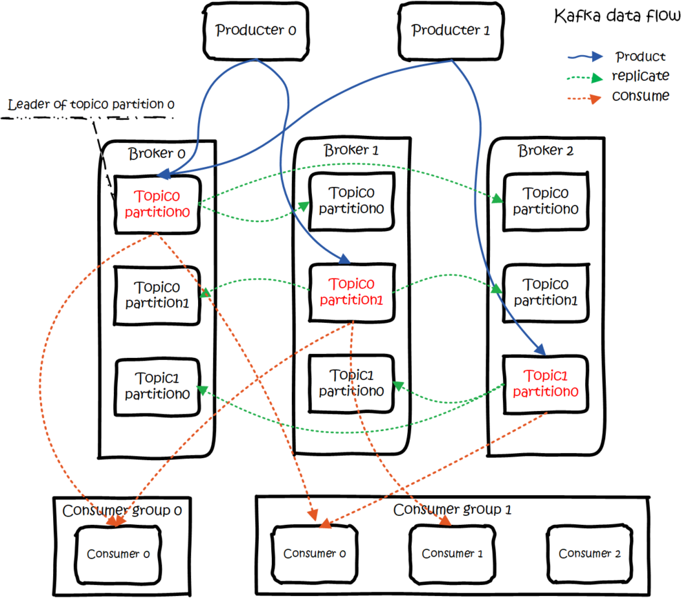
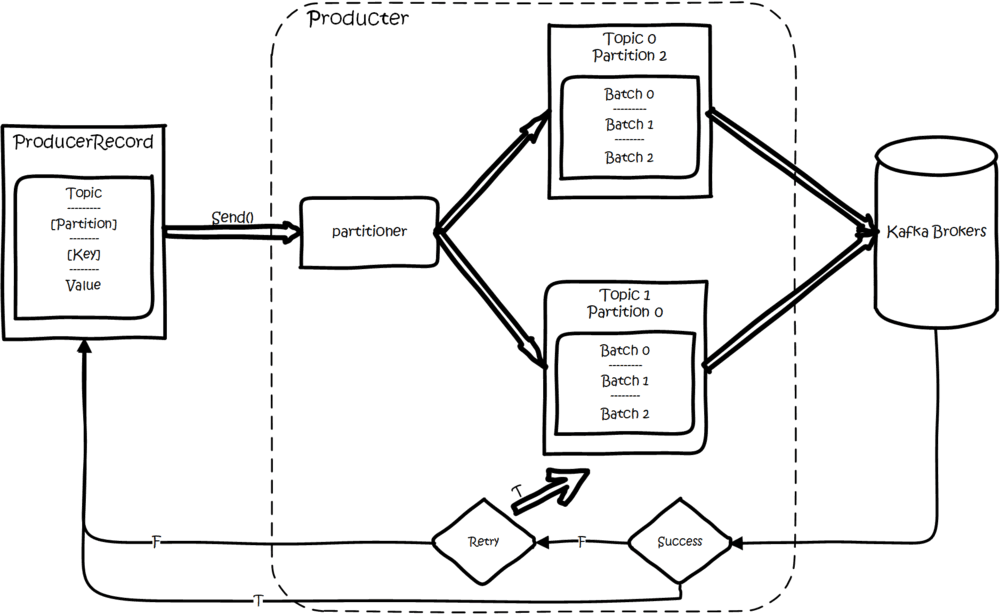

Kafka的一些知识汇总
<!--more-->

#### 一、概念
- Producers：消息的生产者,就是向kafka broker发消息的客户端(push)
- Consumers：消息消费者，就是向kafak broker取消息的客户端(通过pull进行取)
- topic：指kafka处理消息源的不同分类，或称为一个主题，可以理解为MQ(消息队列)的一个名字
- broker：缓存代理，kafka集群中的一台或多台服务器统称为broker,一个broker可以容纳多个topic
- Partition:Topic物理上的分组，为了实现扩展性，一个非常大的topic可以分布到多个broker(服务器)上，一个topic可以分为多个partition,每个partition是一个有序的队列。partition中的每条消息都会被分配一个有序的Id(offset).kafka只保证一个partition中的顺序将消息发送给consumer，不保证一个topic的整体(多个partition间)的顺序，也就是说，一个topic在集群中可以有多个partition,那么分区的策略是什么？(消息发送到哪个分区上，有两种策略，一是采用Key Hash算法，二是采用Round Robin算法)


除了上面几个概念，还有一个也非常重要，那就是 `zookeeper`。


1) `Producer` 端使用 `zookeeper` 用来发现 `broker` 列表，以及和 `Topic` 下每个 `partition leader` 建立 `socket` 连接并发送消息。
2) `Broker` 端使用 `zookeeper` 用来注册 `broker` 信息，已经监测 `partition leader` 存活性。
3) `Consumer` 端使用 `zookeeper` 用来注册 `consumer` 信息,其中包括 `consumer` 消费的 `partition` 列表等，同时也用来发现 `broker` 列表，并和 `partition leader` 建立 `socket` 连接，并获取消息。
4）组内的消费者可以共同处理一个topic的所有消息，而且不会产生冲突，这种协调是通过借助`zookeeper`来实现的，而且这个协调逻辑已经被封装在kafka提供的api中
5） `zookeeper`和`Producer`没有建立关系，只和`Brokers`,`Consumers`建立关系以实现负载均衡，即同一个`Consumer Group`中的`Consumers`可以实现负载均衡

#### 二、Kafka 数据流

`Kafka` 的总体[数据流](https://www.jianshu.com/p/d3e963ff8b70)是这样的：`Producer` 往 `Broker` 里面的指定 `Topic` 中写消息，`Consumers` 从 `Brokers` 里面拉去指定 `Topic` 的消息，然后进行业务处理。

图中有两个 `topic`，`topic 0` 有两个 `partition`，`topic 1` 有一个 `partition` ，三副本备份。可以看到`consumer gourp 1` 中的 `consumer 2` 没有分到 `partition` 处理，这是有可能出现的。

那么，`Kafka` 又是如何[生产数据](https://www.jianshu.com/p/d3e963ff8b70)的？

如上图所示：
- 首先创建一条记录，记录中一定要指定对应的 `topic` 和 `value` ，`key` 和 `partition` 可选。 
- 先序列化，然后按照 `topic` 和 `partition` ，放进对应的发送队列中。
- `kafka produce` 都是批量请求，会积攒一批，然后一起发送，不是调 `send()` 就进行立刻进行网络发包。

如果 `partition` 没填，那么情况会是这样的：
1.填写了 `key`：按照 `key` 进行哈希，相同 `key` 去一个 `partition`。（如果扩展了 `partition` 的数量那么就不能保证了）

2.没填 `key`：`round-robin` 来选 `partition`。


这些要发往同一个 `partition` 的请求按照配置，攒一波，然后由一个单独的线程一次性发过去。


#### 三、Kafka 设计原理
`Kafka` 的设计初衷是希望作为一个统一的信息收集平台，能够实时的收集反馈信息，并需要能够支撑较大的数据量，且具备良好的容错能力。

1.持久性
`kafka` 使用文件存储消息，这就直接决定 `kafka` 在性能上严重依赖文件系统的本身特性.且无论任何 `OS` 下，对文件系统本身的优化几乎没有可能。


文件缓存/直接内存映射等是常用的手段。


因为 `kafka` 是对日志文件进行 `append` 操作，因此磁盘检索的开支是较小的。同时为了减少磁盘写入的次数，`broker` 会将消息暂时 `buffer` 起来，当消息的个数(或尺寸)达到一定阀值时，再 `flush` 到磁盘，这样减少了磁盘`IO` 调用的次数。

2.性能
需要考虑的影响性能点很多，除磁盘 `IO` 之外，我们还需要考虑网络 `IO`，这直接关系到 `kafka` 的吞吐量问题。`kafka` 并没有提供太多高超的技巧：
- 对于 `producer` 端，可以将消息 `buffer` 起来，当消息的条数达到一定阀值时，批量发送给 `broker`;
- 对于 `consumer` 端也是一样，批量 `fetch` 多条消息，不过消息量的大小可以通过配置文件来指定；
- 对于 `broker` 端，似乎有个 `sendfile` 系统调用可以潜在的提升网络 `IO` 的性能：将文件的数据映射到系统内存中，`socket` 直接读取相应的内存区域即可，而无需进程再次 ｀copy｀ 和交换。

其实对于 `producer/consumer/broker` 三者而言，`CPU` 的开支应该都不大，因此启用消息压缩机制是一个良好的策略。压缩需要消耗少量的 `CPU` 资源，不过对于 `kafka` 而言，网络 `IO` 更应该需要考虑。可以将任何在网络上传输的消息都经过压缩。


`kafka` 支持 `gzip/snappy` 等多种压缩方式。


3.生产者
负载均衡: `producer` 将会和 `Topic` 下所有 `partition leader` 保持 `socket` 连接。消息由 `producer` 直接通过 `socket` 发送到 `broker` ，中间不会经过任何路由层。

事实上，消息被路由到哪个 `partition` 上，有 `producer` 客户端决定。比如可以采用`random`、`key-hash`、`轮询`等，如果一个 `topic` 中有多个 `partitions`，那么在 `producer` 端实现「消息均衡分发」是必要的。

4.消费者
`consumer` 端向 `broker` 发送 `fetch` 请求，并告知其获取消息的 `offset`。此后 `consumer` 将会获得一定条数的消息，`consumer` 端也可以重置 `offset` 来重新消费消息。

5.消息传送机制
对于 `JMS` 实现，消息传输担保非常直接：有且只有一次(exactly once)。在 `kafka` 中稍有不同：
- at most once: 最多一次，这个和 `JMS` 中 「非持久化」消息类似。发送一次，无论成败，将不会重发。
- at least once: 消息至少发送一次，如果消息未能接受成功，可能会重发，直到接收成功。
- exactly once: 消息只会发送一次。
- at most once: 消费者 `fetch` 消息，然后保存 `offset`，然后处理消息。当 `client` 保存 `offset` 之后，但是在消息处理过程中出现了异常，导致部分消息未能继续处理。那么此后「未处理」的消息将不能被 `fetch` 到。
- at least once: 消费者 `fetch` 消息，然后处理消息，然后保存 `offset`。如果消息处理成功之后，但是在保存`offset` 阶段 `zookeeper` 异常导致保存操作未能执行成功，这就导致接下来再次 `fetch` 时可能获得上次已经处理过的消息，原因 `offset` 没有及时的提交给 `zookeeper`，`zookeeper` 恢复正常还是之前 `offset` 状态。
- exactly once: `kafka` 中并没有严格的去实现(基于2阶段提交，事务)，我们认为这种策略在 `kafka` 中是没有必要的。


通常情况下「at-least-once」是我们首选。(相比「at most once」而言，重复接收数据总比丢失数据要好)。


6.复制备份
`kafka` 将每个 `partition` 数据复制到多个 `server` 上，任何一个 `partition` 有一个 `leader` 和多个`follower`(可以没有)，备份的个数可以通过 `broker` 配置文件来设定。

- `leader` 处理所有的 `read-write` 请求，`follower` 需要和 `leader` 保持同步。
- `follower` 和 `consumer` 一样，消费消息并保存在本地日志中;
- `leader` 负责跟踪所有的 `follower` 状态，如果 `follower` 落后太多或者失效，`leader` 将会把它从`replicas` 同步列表中删除。
- 当所有的 `follower` 都将一条消息保存成功，此消息才被认为是 `committed`，那么此时 `consumer` 才能消费它。- 即使只有一个 `replicas` 实例存活，仍然可以保证消息的正常发送和接收，只要 `zookeeper` 集群存活即可。(不同于其他分布式存储，比如 `hbase` 需要「多数派」存活才行)
- 当 `leader` 失效时，需在 `followers` 中选取出新的 `leader`，可能此时 `follower` 落后于 `leader`，因此需要选择一个 `up-to-date` 的 `follower`。
- 选择 `follower` 时需要兼顾一个问题，就是新 `leader server` 上所已经承载的 `partition leader` 的个数，如果一个 `server` 上有过多的 `partition leader`，意味着此 `server` 将承受着更多的 `IO` 压力。
- 在选举新 `leader`，需要考虑到负载均衡。

7.日志
日志文件中保存了一序列 `log entries`(日志条目)，每个 `log entry` 格式为「4个字节的数字N表示消息的长度」 + 「N个字节的消息内容」;

每个日志都有一个 `offset` 来唯一的标记一条消息，`offset` 的值为 8 个字节的数字，表示此消息在此 `partition` 中所处的起始位置。

每个 `partition` 在物理存储层面，有多个 `log file` 组成(称为 `segment`)。`segmentfile` 的命名为 "最小offset".kafka

8.分配
`kafka` 使用 `zookeeper` 来存储一些 `meta` 信息，并使用了 `zookeeper watch` 机制来发现 `meta` 信息的变更并作出相应的动作(比如 `consumer` 失效，触发负载均衡等)

更多细节，请移步 [Kafka 入门](http://www.aboutyun.com/thread-9341-1-1.html)。