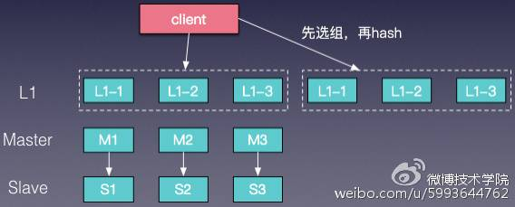

<!-- TOC -->

- [分布式缓存](#分布式缓存)
  - [**分布式缓存的实现方式**](#分布式缓存的实现方式)
    - [**数据分片**](#数据分片)
    - [**可用性**](#可用性)
    - [**扩展性**](#扩展性)
  - [**缓存设计实践**](#缓存设计实践)
  - [Paxos 算法](#paxos-算法)
  - [Raft 算法](#raft-算法)
  - [Gossip 协议](#gossip-协议)
    - [高可用性](#高可用性)
    - [如何保证不被重复消费](#如何保证不被重复消费)
    - [**消费的可靠性传输**](#消费的可靠性传输)
- [分布式任务（事务）调度系统](#分布式任务事务调度系统)

<!-- /TOC -->
## 分布式缓存

### **分布式缓存的实现方式**

#### **数据分片**

数据分片就是把数据均匀分散到多个实例中。数据分片可以采用以下几种规则：区间分片、hash分片、 slot分片。对于hash分片，主要的哈希算法有静态哈希和一致性哈希，静态哈希和一致性哈希对比如下：

* 静态哈希\(取模求余\)

  优点：算法简单

  缺点：加减节点时震荡厉害, 命中率下降厉害

* 一致性哈希

  优点：加减节点时震荡较小, 保持较高命中率

  缺点：自动rehash场景下会数据不一致的问题\(同一份数据的请求在不同节点漂移\)

  数据分片的实现方式分为三种：

* 客户端实现：memcached，redis 2.x

客户端实ee现数据分片

优点：简单，容易实现

缺点：扩缩容需要重新上线，手动数据迁移；

* proxy实现：twemproxy，codis，微博内部实现了CacheService

  通过引入一层代理，将数据分片策略放在代理层实现，客户端通过代理来访问数据。

  优点：逻辑在proxy实现，客户端使用简单，支持多语言

  缺点：数据访问多一跳，有一定的性能损耗

* 服务端实现：redis 3.x，cassandra

  由缓存组件本身，实现数据分片机制。

  优点：扩缩容方便，自动数据迁移

  缺点：数据存储与分布式逻辑耦合在一起，服务端复杂

#### **可用性**

线上使用过程中，如果出现某些缓存实例不可用，大量请求穿透会给DB带来巨大的压力，极端情况会导致雪崩场景，这需要有更好的方式保证缓存的高可用。于是我们采用用主从\(Master/Slave\)的架构，如图6。也就是在原有单层缓存的结构下，增加一层Slave，来保证即使某个Master节点宕机，整个缓存层依然是可用的，不会出现大量请求穿透DB的情况。

#### **扩展性**

主从结构部署已经能很好的满足大多数业务场景，但是在微博这种存在突发热点引起流量骤增的业务场景下仍然存在一定的问题，这种方式并不能很方便的进行横向扩展，如果直接在原有的缓存中增加新的节点，就需要涉及到数据迁移等工作。为了解决横向扩展的问题，增加了L1 Cache，实现了多级缓存，L1 Cache的容量一般小于Master容量，也就是说L1 Cache中的数据热度要更高；同时L1 Cache可以有多组，需要横向扩展的时候，只需要成组扩容L1 Cache即可，如图

cache

在L1 Cache这种结构下，Master/Slave的访问量会小很多，会出现Master/Slave数据变冷的情况，为了改善这种情况，我们把Master/Slave在逻辑上也作为L1 Cache的一组，这样就保证了Master/Slave的热度。如图8，是把Master作为L1的一组。

master作为L1 cache

### **缓存设计实践**

**缓存容量规划**

进行缓存容量规划时，主要从以下几个方面进行考虑：

* 请求量
* 命中率：预热，防止雪崩
* 网络带宽：网卡、交换机
* 存储容量：预估存储大小，过期策略、剔除率
* 连接数

**数据一致性**

我们知道，在CAP理论下，只能取其二，而无法保证全部。在分布式缓存中，通常要保证可用性\\(A\\)和可扩展性\\(P\\)，并折中采用数据最终一致性，最终一致性包括：

* Master与副本一致性
* Cache与Storage一致性
* 业务各维度缓存数据一致性

**极热点数据场景**

微博在遇到一些突发事件时\\(如文章事件\\)，流量会出现爆发式的增长，大量的热点数集中访问，导致某个缓存资源遇到性能瓶颈\\(比如明星的数据所在的端口\\)，最终接口响应变慢影响正常的服务。为了应对这个问题我们在前端使用local cache, 以缓解后端缓存的压力。但是有些业务场景下，由于各种海量业务数据的冲刷，前端使用 local cache，命中率可能不高，性能提升也不明显，这种业务场景下可以考虑引入L1结构，通过部署多组小容量的L1缓存来应对突然的访问量增长。

**dog-pile effect \(狗桩效应\)**

狗桩效应是由于极热访问的缓存数据失效，大量请求发现没有缓存，进而穿透至DB，导致数据库load瞬间飙高甚至宕机。这是一个典型的并发访问穿透问题，理想情况下缓存失效对数据库应该只有一次穿透。要解决这个问题，首先从代码层面就要考虑到并发穿透的情况，保证一个进程只有一次穿透；同时，可以考虑使用基于mc的分布式锁来控制。不过使用分布式锁来实现会较为繁琐，通常在代码层面进行控制，就可以得到很好的效果。

* ## CAP理论

  CAP定理是分布式系统设计中最基础，也是最关键的理论。它指出，分布式数据存储不可能同时满足以下三个条件

* 一致性（consistency）每次读取要么获得最进写入的数据，要么获得一个错误

* 可用性（availability）每次请求都能获得一个（非错误）响应，但不保证返回的是最新写入的数据

* 分区容忍（partition tolerance）尽管任意数量的消息被节点间的网络丢失（或延迟），系统仍能继续运行

也就是说，CAP 定理表明，在存在网络分区的情况下，一致性和可用性必须二选一。而在没有发生网络故障时，即分布式系统正常运行时，一致性和可用性是可以同时被满足的。这里需要注意的是，CAP 定理中的一致性与 ACID 数据库事务中的一致性截然不同。

掌握 CAP 定理，尤其是能够正确理解 C、A、P 的含义，对于系统架构来说非常重要。因为对于分布式系统来说，网络故障在所难免，如何在出现网络故障的时候，维持系统按照正常的行为逻辑运行就显得尤为重要。你可以结合实际的业务场景和具体需求，来进行权衡。

例如，对于大多数互联网应用来说（如门户网站），因为机器数量庞大，部署节点分散，网络故障是常态，可用性是必须要保证的，所以只有舍弃一致性来保证服务的 AP。而对于银行等，需要确保一致性的场景，通常会权衡 CA 和 CP 模型，CA 模型网络故障时完全不可用，CP 模型具备部分可用性。

CA \(consistency + availability\)，这样的系统关注一致性和可用性，它需要非常严格的全体一致的协议，比如“两阶段提交”（2PC）。CA 系统不能容忍网络错误或节点错误，一旦出现这样的问题，整个系统就会拒绝写请求，因为它并不知道对面的那个结点是否挂掉了，还是只是网络问题。唯一安全的做法就是把自己变成只读的。

CP \(consistency + partition tolerance\)，这样的系统关注一致性和分区容忍性。它关注的是系统里大多数人的一致性协议，比如：Paxos 算法 \(Quorum 类的算法\)。这样的系统只需要保证大多数结点数据一致，而少数的结点会在没有同步到最新版本的数据时变成不可用的状态。这样能够提供一部分的可用性。

AP \(availability + partition tolerance\)，这样的系统关心可用性和分区容忍性。因此，这样的系统不能达成一致性，需要给出数据冲突，给出数据冲突就需要维护数据版本。Dynamo 就是这样的系统。

然而，还是有一些人会错误地理解 CAP 定理，甚至误用。Cloudera 工程博客中，CAP Confusion: Problems with ‘partition tolerance’一文中对此有详细的阐述。

在谷歌的Transaction Across DataCenter 视频中，我们可以看到下面这样的图。这个是 CAP 理论在具体工程中的体现。

* ## 分布式事务，Raft，Paxos

### Paxos 算法

Paxos 算法，是莱斯利·兰伯特（Lesile Lamport）于 1990 年提出来的一种基于消息传递且具有高度容错特性的一致性算法。但是这个算法太过于晦涩，所以，一直以来都处于理论上的论文性质的东西。

其进入工程圈的源头在于 Google 的 Chubby lock——一个分布式的锁服务，用在了 Bigtable 中。直到 Google 发布了下面的这两篇论文，Paxos 才进入到工程界的视野中来。

Bigtable: A Distributed Storage System for Structured Data

The Chubby lock service for loosely-coupled distributed systems

Google 与 Big Table 相齐名的还有另外两篇论文。

The Google File System

MapReduce: Simplifed Data Processing on Large Clusters

还有一篇可以帮你理解的文章是Paxos by Examples。

ZooKeeper 有和 Paxos 非常相似的一些特征，比如，领导选举、提案号等，但是它本质上不是 Paxos 协议，而是自己发明的 Zab 协议，有兴趣的话，可以读一下这篇论文： Zab: High-Performance broadcast for primary-backup systems。

上述的 Google File System、MapReduce、Bigtable 并称为“谷三篇”。基本上来说，整个世界工程系统因为这三篇文章，开始向分布式系统演化，而云计算中的很多关键技术也是因为这三篇文章才得以成熟。 后来，雅虎公司也基于这三篇论文开发了一个开源的软件——Hadoop。

### Raft 算法

因为 Paxos 算法太过于晦涩，而且在实际的实现上有太多的坑，并不太容易写对。所以，有人搞出了另外一个一致性的算法，叫 Raft。其原始论文是 In search of an Understandable Consensus Algorithm \(Extended Version\) 寻找一种易于理解的 Raft 算法。这篇论文的译文在 InfoQ 上《Raft 一致性算法论文译文》，推荐你读一读。

Raft 算法和 Paxos 的性能和功能是一样的，但是它和 Paxos 算法的结构不一样，这使 Raft 算法更容易理解并且更容易实现。那么 Raft 是怎样做到的呢？

Raft 把这个一致性的算法分解成了几个部分，一个是领导选举（Leader Selection），一个是日志复制（Log Replication），一个是安全性（Safety），还有一个是成员变化（Membership Changes）。对于一般人来说，Raft 协议比 Paxos 的学习曲线更低，也更平滑。

Raft 协议中有一个状态机，每个结点会有三个状态，分别是 Leader、Candidate 和 Follower。Follower 只响应其他服务器的请求，如果没有收到任何信息，它就会成为一个 Candidate，并开始进行选举。收到大多数人同意选票的人会成为新的 Leader。

一旦选举出了一个 Leader，它就开始负责服务客户端的请求。每个客户端的请求都包含一个要被复制状态机执行的指令。Leader 首先要把这个指令追加到 log 中形成一个新的 entry，然后通过 AppendEntries RPC 并行地把该 entry 发给其他服务器（server）。如果其他服务器没发现问题，复制成功后会给 Leader 一个表示成功的 ACK。

Leader 收到大多数 ACK 后应用该日志，返回客户端执行结果。如果 Follower 崩溃 （crash）或者丢包，Leader 会不断重试 AppendEntries RPC。

p.p1 {margin: 0.0px 0.0px 0.0px 0.0px; line-height: 19.0px; font: 13.0px 'Helvetica Neue'}  
p.p2 {margin: 0.0px 0.0px 0.0px 0.0px; line-height: 19.0px; font: 13.0px 'Helvetica Neue'; min-height: 15.0px}

### Gossip 协议

另外，DynamoDB 中使用到了 Gossip 协议来做数据同步，这个协议的原始论文是 Efficient Reconciliation and Flow Control for Anti-Entropy Protocols。Gossip 算法也是 Cassandra 使用的数据复制协议。这个协议就像八卦和谣言传播一样，可以 “一传十、十传百”传播开来。但是这个协议看似简单，细节上却非常麻烦。

根据这篇论文，节点之间存在三种通信方式。

push 方式。A 节点将数据 \(key,value,version\) 及对应的版本号推送给 B 节点，B 节点更新 A 中比自己新的数据。

pull 方式。A 仅将数据 key,version 推送给 B，B 将本地比 A 新的数据 \(key,value,version\) 推送给 A，A 更新本地。

push/pull 方式。与 pull 类似，只是多了一步，A 再将本地比 B 新的数据推送给 B，B 更新本地。

如果把两个节点数据同步一次定义为一个周期，那么在一个周期内，push 需通信 1 次，pull 需 2 次，push/pull 则需 3 次。从效果上来讲，push/pull 最好，理论上一个周期内可以使两个节点完全一致。直观感觉上，也是 push/pull 的收敛速度最快。

另外，每个节点上的又需要一个协调机制，也就是如何交换数据能达到最快的一致性——消除节点的不一致性。上面所讲的 push、pull 等是通信方式，协调是在通信方式下的数据交换机制。

协调所面临的最大问题是，一方面需要找到一个经济的方式，因为不可能每次都把一个节点上的数据发送给另一个节点；另一方面，还需要考虑到相关的容错方式，也就是当因为网络问题不可达的时候，怎么办？

一般来说，有两种机制：一种是以固定概率传播的 Anti-Entropy 机制，另一种是仅传播新到达数据的 Rumor-Mongering 机制。前者有完备的容错性，但是需要更多的网络和 CPU 资源，后者则反过来，不耗资源，但在容错性上难以保证。

* ## 一致性哈希
* ## 分布式消息队列

#### 高可用性

#### 如何保证不被重复消费

#### **消费的可靠性传输**

## 分布式任务（事务）调度系统

[https://juejin.im/post/5aa3c7736fb9a028bb189bca](https://juejin.im/post/5aa3c7736fb9a028bb189bca)

* 分布式事务的解决方案有如下几种：

  * 全局消息（DTP模型）
  * 基于可靠消息服务的分布式事务
  * TCC
  * 最大努力通知

Taskcenter就是采用的第二个方案，扮演协调者的角色

上游系统与协调者采用异步通信，协调者与下游采取同步通信

消息投递失败后为什么不回滚消息，而是不断尝试重新投递？

这就涉及到整套分布式事务系统的实现成本问题。 我们知道，当系统A将向消息中间件发送Commit指令后，它便去做别的事情了。如果此时消息投递失败，需要回滚的话，就需要让系统A事先提供回滚接口，这无疑增加了额外的开发成本，业务系统的复杂度也将提高。对于一个业务系统的设计目标是，在保证性能的前提下，最大限度地降低系统复杂度，从而能够降低系统的运维成本。

