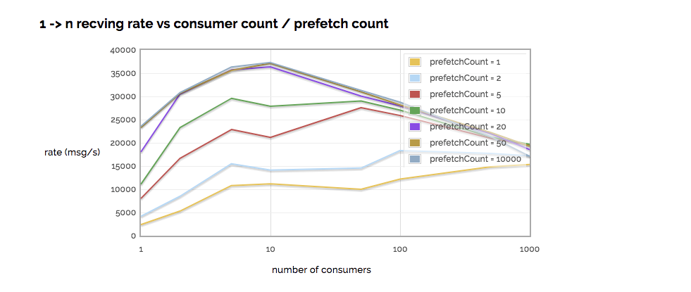

Rabbitmq是一个高性能高可靠的消息队列, 但想将其性能完全开发出来, 对使用要求者要求较高。

本文记录Rabbitmq使用时的一些最佳实践。
<!--more-->

### 队列
* 使用持久队列能保证消息落盘，但会影响吞吐量
* 使用auto-ack能是消费速度大量提升，但如果consumer下线时，消息会丢失
* 突然的，大类的消息入列，而此时消费速度如果赶不上，就会导致RAM被大量侵蚀，使消息入列停止，甚至mq服务器崩溃。所以保持队列里消息的量是关键
* RabbitMQ 3.6 之后，提供了 lazy queues， 消息先写到硬盘中，需要消费时才进入RAM，使内存不会被突然耗光。但代价是吞吐耗时增加

### 负载
* 每个连接会占用100KB的RAM，所以不要使用太多connection，而是在一个TCP连接上用多个channel
* 不要频繁打开关闭connection。 channel的打开关闭可以相对较多
* publisher和consumer不要使用同一个连接
* 
### 消费
影响消费速度的三个关键因素：
* 每个消息具体的处理逻辑的耗时
* consumer的数量
* prefetch count  的设置

这三个因素都会成为消费的瓶颈

### Prefetch
* prefetch只有在手动ack时有效，auto-ack时不生效
* prefetch是指同一时间你要给consumer多少个消息进行缓存，这样能提高consumer效率，避免consumer等待
* 如果consumer只有一个或者较少，推荐使用较大的prefetch（可以估算为：整个轮询时间 /  消费真正处理的逻辑时间），这样能保证consumer总是忙碌的
* 如果consumer较多，但处理的逻辑时间较短，可以用一个相对不高的值。太低会导致consumer空转，太高会使某个consumer一直忙碌
* 如果consumer较多，但处理的逻辑时间较长，可以设为1，使任务均匀分布
下图是网上测试的结果（http://www.rabbitmq.com/blog/2012/04/25/rabbitmq-performance-measurements-part-2/）

(本文翻译参考至：https://www.cloudamqp.com/blog/2017-12-29-part1-rabbitmq-best-practice.html)

