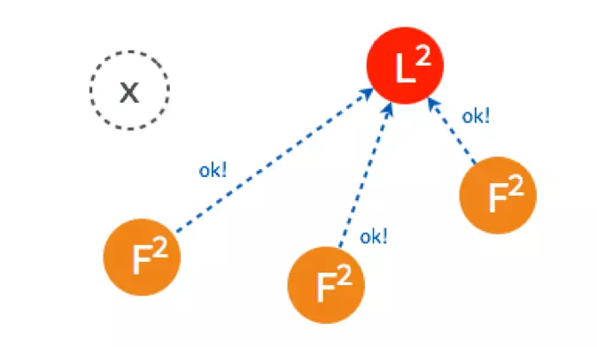
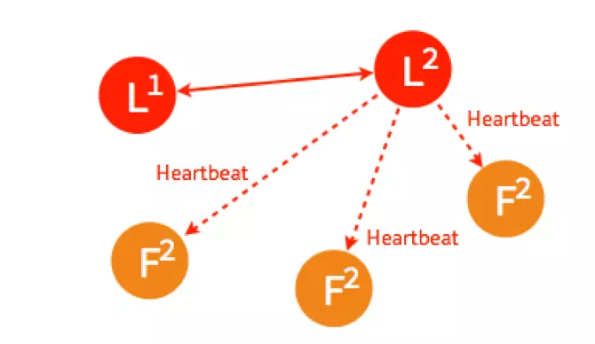
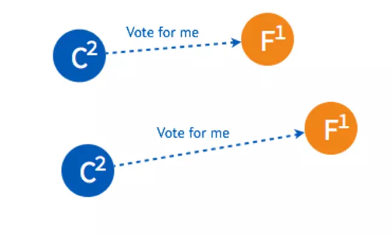
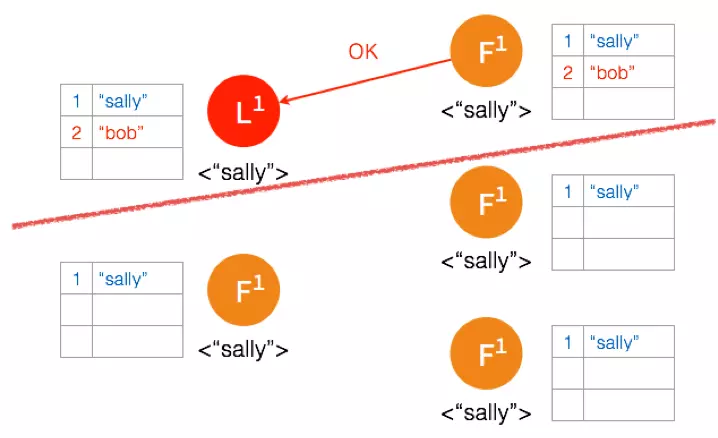
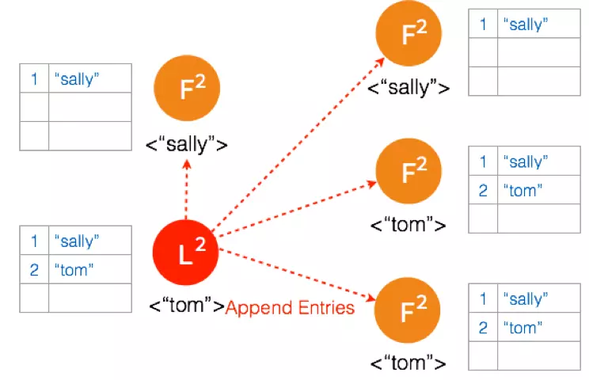

解决分布式一致性问题的算法中，最先被证明的是Paxos算法，但运用最广的却是Raft算法。与Paxos 相比，Raft 有着基本相同运行效率，但是更容易理解，也更容易被用在系统开发上
<!--more-->

<!-- TOC -->

- [背景](#%E8%83%8C%E6%99%AF)
- [Raft算法](#raft%E7%AE%97%E6%B3%95)
  - [思路](#%E6%80%9D%E8%B7%AF)
  - [Raft节点状态](#raft%E8%8A%82%E7%82%B9%E7%8A%B6%E6%80%81)
  - [选主 Leader Election](#%E9%80%89%E4%B8%BB-leader-election)
    - [正常情况选主](#%E6%AD%A3%E5%B8%B8%E6%83%85%E5%86%B5%E9%80%89%E4%B8%BB)
    - [Leader 出故障情况下的选主](#leader-%E5%87%BA%E6%95%85%E9%9A%9C%E6%83%85%E5%86%B5%E4%B8%8B%E7%9A%84%E9%80%89%E4%B8%BB)
    - [多个 Candidate 情况下的选主](#%E5%A4%9A%E4%B8%AA-candidate-%E6%83%85%E5%86%B5%E4%B8%8B%E7%9A%84%E9%80%89%E4%B8%BB)
  - [复制日志 Log Replication](#%E5%A4%8D%E5%88%B6%E6%97%A5%E5%BF%97-log-replication)
    - [正常情况下复制日志](#%E6%AD%A3%E5%B8%B8%E6%83%85%E5%86%B5%E4%B8%8B%E5%A4%8D%E5%88%B6%E6%97%A5%E5%BF%97)
    - [Network Partition 情况下进行复制日志](#network-partition-%E6%83%85%E5%86%B5%E4%B8%8B%E8%BF%9B%E8%A1%8C%E5%A4%8D%E5%88%B6%E6%97%A5%E5%BF%97)
- [Raft VS Paxos](#raft-vs-paxos)

<!-- /TOC -->
## 背景
> 拜占庭将军问题是分布式领域最复杂、最严格的容错模型。但在日常工作中使用的分布式系统面对的问题不会那么复杂，更多的是计算机故障挂掉了，或者网络通信问题而没法传递信息，这种情况不考虑计算机之间互相发送恶意信息，极大简化了系统对容错的要求，最主要的是达到一致性。

所以将拜占庭将军问题根据常见的工作上的问题进行简化：**假设将军中没有叛军，信使的信息可靠但有可能被暗杀的情况下，将军们如何达成一致性决定？** 

对于这个简化后的问题，有许多解决方案，第一个被证明的共识算法是 Paxos，由拜占庭将军问题的作者 Leslie Lamport 在1990年提出，最初以论文难懂而出名，后来这哥们在2001重新发了一篇简单版的论文 Paxos Made Simple，然而还是挺难懂的。 

因为 Paxos 难懂，难实现，所以斯坦福大学的教授在2014年发表了新的分布式协议 Raft。与 Paxos 相比，Raft 有着基本相同运行效率，但是更容易理解，也更容易被用在系统开发上。

## Raft算法
### 思路
我们还是用拜占庭将军的例子来帮助理解 Raft。 

> 假设将军中没有叛军，信使的信息可靠但有可能被暗杀的情况下，将军们如何达成一致性决定？

Raft 的解决方案大概可以理解成 先在所有将军中选出一个大将军，所有的决定由大将军来做。选举环节：比如说现在一共有3个将军 A, B, C，每个将军都有一个随机时间的倒计时器，倒计时一结束，这个将军就会把自己当成大将军候选人，然后派信使去问其他几个将军，能不能选我为总将军？假设现在将军A倒计时结束了，他派信使传递选举投票的信息给将军B和C，如果将军B和C还没把自己当成候选人（倒计时还没有结束），并且没有把选举票投给其他，他们把票投给将军A，信使在回到将军A时，将军A知道自己收到了足够的票数，成为了大将军。在这之后，是否要进攻就由大将军决定，然后派信使去通知另外两个将军，如果在一段时间后还没有收到回复（可能信使被暗杀），那就再重派一个信使，直到收到回复。 

故事先讲到这里，希望不做技术方面的朋友可以大概能理解 Raft 的原理，下面从比较技术的角度讲讲 Raft 的原理。

### Raft节点状态
从拜占庭将军的故事映射到分布式系统上，每个将军相当于一个分布式网络节点，每个节点有三种状态：**Follower，Candidate，Leader**，状态之间是互相转换的，可以参考下图，具体的后面说。

每个节点上都有一个倒计时器 (Election Timeout)，时间随机在 150ms 到 300ms 之间。有几种情况会重设 Timeout： 

- 收到选举的请求
- 收到 Leader 的 Heartbeat (后面会讲到) 
  
在 Raft 运行过程中，最主要进行两个活动： 

- 选主 Leader Election<
- 复制日志 Log Replication

### 选主 Leader Election
#### 正常情况选主

假设现在有如图5个节点，5个节点一开始的状态都是 Follower。

在一个节点倒计时结束 (Timeout) 后，这个节点的状态变成 Candidate 开始选举，它给其他几个节点发送选举请求 (RequestVote)

其他四个节点都返回成功，这个节点的状态由 Candidate 变成了 Leader，并在每个一小段时间后，就给所有的 Follower 发送一个 Heartbeat 以保持所有节点的状态，Follower 收到 Leader 的 Heartbeat 后重设 Timeout。 
这是最简单的选主情况，**只要有超过一半的节点投支持票了，Candidate 才会被选举为 Leader**，5个节点的情况下，3个节点 (包括 Candidate 本身) 投了支持就行。

####  Leader 出故障情况下的选主

一开始已经有一个 Leader，所有节点正常运行。

Leader 出故障挂掉了，其他四个 Follower 将进行重新选主。

4个节点的选主过程和5个节点的类似，在选出一个新的 Leader 后，原来的 Leader 恢复了又重新加入了，这个时候怎么处理？在 Raft 里，第几轮选举是有记录的，重新加入的 Leader 是第一轮选举 (Term 1) 选出来的，而现在的 Leader 则是 Term 2，所有原来的 Leader 会自觉降级为 Follower

#### 多个 Candidate 情况下的选主

假设一开始有4个节点，都还是 Follower。

有两个 Follower 同时 Timeout，都变成了 Candidate 开始选举，分别给一个 Follower 发送了投票请求。

两个 Follower 分别返回了ok，这时两个 Candidate 都只有2票，要3票才能被选成 Leader。

两个 Candidate 会分别给另外一个还没有给自己投票的 Follower 发送投票请求。

但是因为 Follower 在这一轮选举中，都已经投完票了，所以都拒绝了他们的请求。所以在 Term 2 没有 Leader 被选出来。

这时，两个节点的状态是 Candidate，两个是 Follower，但是他们的倒计时器仍然在运行，最先 Timeout 的那个节点会进行发起新一轮 Term 3 的投票。

两个 Follower 在 Term 3 还没投过票，所以返回 OK，这时 Candidate 一共有三票，被选为了 Leader。

如果 Leader Heartbeat 的时间晚于另外一个 Candidate timeout 的时间，另外一个 Candidate 仍然会发送选举请求。

两个 Follower 已经投完票了，拒绝了这个 Candidate 的投票请求。

Leader 进行 Heartbeat， Candidate 收到后状态自动转为 Follower，完成选主。 

以上是 Raft 最重要活动之一选主的介绍，以及在不同情况下如何进行选主。

### 复制日志 Log Replication
#### 正常情况下复制日志
Raft 在实际应用场景中的一致性更多的是体现在不同节点之间的数据一致性，客户端发送请求到任何一个节点都能收到一致的返回，当一个节点出故障后，其他节点仍然能以已有的数据正常进行。在选主之后的复制日志就是为了达到这个目的。

一开始，Leader 和 两个 Follower 都没有任何数据。

客户端发送请求给 Leader，储存数据 “sally”，Leader 先将数据写在本地日志，这时候数据还是 Uncommitted (还没最终确认，红色表示)

Leader 给两个 Follower 发送 AppendEntries 请求，数据在 Follower 上没有冲突，则将数据暂时写在本地日志，Follower 的数据也还是 Uncommitted。

Follower 将数据写到本地后，返回 OK。Leader 收到后成功返回，只要收到的成功的返回数量超过半数 (包含Leader)，Leader 将数据 “sally” 的状态改成 Committed。( 这个时候 Leader 就可以返回给客户端了)

Leader 再次给 Follower 发送 AppendEntries 请求，收到请求后，Follower 将本地日志里 Uncommitted 数据改成 Committed。这样就完成了一整个复制日志的过程，三个节点的数据是一致的，

#### Network Partition 情况下进行复制日志
在 Network Partition 的情况下，部分节点之间没办法互相通信，Raft 也能保证在这种情况下数据的一致性。

一开始有 5 个节点处于同一网络状态下。

Network Partition 将节点分成两边，一边有两个节点，一边三个节点。

两个节点这边已经有 Leader 了，来自客户端的数据 “bob” 通过 Leader 同步到 Follower。

因为只有两个节点，少于3个节点，所以 “bob” 的状态仍是 Uncommitted。所以在这里，服务器会返回错误给客户端

另外一个 Partition 有三个节点，进行重新选主。客户端数据 “tom” 发到新的 Leader，通过和上节网络状态下相似的过程，同步到另外两个 Follower。

因为这个 Partition 有3个节点，超过半数，所以数据 “tom” 都 Commit 了。

网络状态恢复，5个节点再次处于同一个网络状态下。但是这里出现了数据冲突 “bob" 和 “tom"

三个节点的 Leader 广播 AppendEntries

两个节点 Partition 的 Leader 自动降级为 Follower，因为这个 Partition 的数据 “bob” 没有 Commit，返回给客户端的是错误，客户端知道请求没有成功，所以 Follower 在收到 AppendEntries 请求时，可以把 “bob“ 删除，然后同步 ”tom”，通过这么一个过程，就完成了在 Network Partition 情况下的复制日志，保证了数据的一致性。

## Raft VS Paxos
Raft协议比paxos的优点是 容易理解，容易实现。它强化了leader的地位，把整个协议可以清楚的分割成两个部分，并利用日志的连续性做了一些简化：
- Leader在时。由Leader向Follower同步日志
- Leader挂掉了，选一个新Leader，Leader选举算法。

但是本质上来说，它容易的地方在于流程清晰，描述更清晰，关键之处都给出了伪代码级别的描述，可以直接用于实现，而paxos最初的描述是针对非常理论的一致性问题，真正能应用于工程实现的mulit-paxos，Lamport老爷爷就提了个大概，之后也有人尝试对multi-paxos做出更为完整详细的描述，但是每个人描述的都不大一样。

Paxos和raft都是一旦一个entries（raft协议叫日志，paxos叫提案，叫法而已）得到多数派的赞成，这个entries就会定下来，不丢失，值不更改，最终所有节点都会赞成它。Paxos中称为提案被决定，Raft,ZAB,VR称为日志被提交，这只是说法问题。一个日志一旦被提交(或者决定），就不会丢失，也不可能更改，这一点这4个协议都是一致的。Multi-paxos和Raft都用一个数字来标识leader的合法性，multi-paxos中叫proposer-id，Raft叫term，意义是一样的，multi-paxos proposer-id最大的Leader提出的决议才是有效的，raft协议中term最大的leader才是合法的。实际上raft协议在leader选举阶段，由于老leader可能也还存活，也会存在不只一个leader的情形，只是不存在term一样的两个leader，因为选举算法要求leader得到同一个term的多数派的同意，同时赞同的成员会承诺不接受term更小的任何消息。这样可以根据term大小来区分谁是合法的leader。Multi-paxos的区分leader的合法性策略其实是一样的，谁的proproser-id大谁合法，而proposer-id是唯一的。因此它们其实在同一个时刻，都只会存在一个合法的leader。同时raft协议的Leader选举算法，新选举出的Leader已经拥有全部的可以被提交的日志，而multi-paxos择不需要保证这一点，这也意味multi-paxos需要额外的流程从其它节点获取已经被提交的日志。因此raft协议日志可以简单的只从leader流向follower在raft协议中，而multi-paxos则需要额外的流程补全已提交的日志。需要注意的是日志可以被提交和日志已经被提交是两个概念，它们的区别就像是我前方有块石头和我得知我前方有块石头。但是实际上，Raft和multi-Paxos一旦日志可以被提交，就能会保证不丢失，multi-paxos天然保证了这一点，这也是为什么新leader对于尚未被确认已经提交的日志需要重新执行经典paxos的阶段一，来补全可能缺失的已经被提交的日志，Raft协议通过强制新Leader首先提交一个本term的no-op 日志，配合前面提到的Leader选举算法所保证的性质，确保了这一点。一条日志一旦被多数派的节点写入本地日志文件中，就可以被提交，但是leader只有得知这一点后，才会真正commit这条日志，此时日志才是已经被提交的。  

Raft协议强调日志的连续性，multi-paxos则允许日志有空洞。日志的连续性蕴含了这样一条性质：如果两个不同节点上相同序号的日志，只要term相同，那么这两条日志必然相同，且这和这之前的日志必然也相同的，这使得leader想follower同步日志时，比对日志非常的快速和方便；同时Raft协议中日志的commit（提交）也是连续的，一条日志被提交，代表这条日志之前所有的日志都已被提交，一条日志可以被提交，代表之前所有的日志都可以被提交。日志的连续性使得Raft协议中，知道一个节点的日志情况非常简单，只需要获取它最后一条日志的序号和term。可以举个列子，A,B,C三台机器，C是Leader，term是3，A告诉C它们最后一个日志的序列号都是4，term都是3，那么C就知道A肯定有序列号为1,2,3,4的日志，而且和C中的序列号为1,2,3,4的日志一样，这是raft协议日志的连续性所强调的，好了那么Leader知道日志1，2，3，4已经被多数派（A,C)拥有了，可以提交了。同时，这也保证raft协议在leader选举的时候，一个多数派里必然存在一个节点拥有全部的已提交的日志，这是由于最后一条被commit的日志，至少被多数派记录，而由于日志的连续性，拥有最后一条commit的日志也就意味着拥有全部的commit日志，即至少有一个多数派拥有所有已commit的日志。并且只需要从一个多数集中选择最后出最后一条日志term最大且序号最大的节点作为leader，新leader必定是拥有全部已commit的日志(关于这一点的论证，可以通过反证法思考一下，多数集中节点A拥有最后一条已commit的日志，但是B没有，而B当选leader。根据选主的法则只能有两种可能(1)当选而A最后一条日志的term小于B；(2)A最后一条日志的term等于B，但是A的日志少于B。1,2可能嘛？）而对于multi-paxos来说，日志是有空洞的，每个日志需要单独被确认是否可以commit，也可以单独commit。因此当新leader产生后，它只好重新对每个未提交的日志进行确认，已确定它们是否可以被commit，甚至于新leader可能缺失可以被提交的日志，需要通过Paxos阶段一向其它节点学习到缺失的可以被提交的日志，当然这都可以通过向一个多数派询问完成（这个流程存在着很大的优化空间，例如可以将这个流程合并到leader选举阶段，可以将所有日志的确认和学习合并到一轮消息中，减少消息数目等）。但是无论是Raft还是multi-paxos，新leader对于那些未提交的日志，都需要重新提交，不能随意覆写，因为两者都无法判定这些未提交的日志是否已经被之前的leader提交了。所以本质上，两者是一样的。一个日志被多数派拥有，那么它就可以被提交，但是Leader需要通过某种方式得知这一点，同时为了已经被提交的日志不被新leader覆写，新leader需要拥有所有已经被提交的日志（或者说可以被提交，因为有时候并没有办法得知一条可以被提交的日志是否已经被提交，例如当只有老leader提交了该日志，并返回客户端成功，然而老leader挂了），之后才能正常工作，并且需要重新提交所有未commit的日志。两者的区别在于Leader确认提交和获取所有可以被提交日志的方式上，而方式上的区别又是由于是日志是否连续造成的，Raft协议利用日志连续性，简化了这个过程。  
    
在Raft和multi-paxos协议确保安全性的原理上，更进一步的说，所有的凡是 满足 集群中存活的节点数还能构成一个多数派，一致性就能满足的算法，raft协议，paxos，zab，viewstamp都是利用了同一个性质：两个多数派集合之间存在一个公共成员。对于一致性协议来说，一旦一个变量的值被确定，那么这个变量的值应该是唯一的，不再更改的。Raft,paoxos等协议，对于一个变量v来说，一个由节点n1提出的值a只有被一个多数集q1认可并记录后，才会正式令v=a，如果另一个节点n2想要修改变量v的值为b，也需要一个多数集q2的认可，而q1和q2必然至少有一个共同的成员p,节点p已经记录了v=a。因此只需要通过增加一些约束，让p能够告诉节点n2这个事实：v=a，使得n2放弃自己的提议，或者让节点p拒绝节点n2想要赋予v的值为b这个行为，都可以确保变量v的一致性不被破坏。这个思想对于这个四个协议来说都是一样的，4个协议都使用一个唯一的整数作为标识符来标明leader的合法性，paxos叫做proposer-id，ZAB叫epoch，VR叫view，raft叫term。把leader看做是想要赋予变量v某个值的节点n1,n2，上面提到的情形中，如果n2是目前的合法leader，那么n2需要知道v=a这个事实，对于raft来说就是选择n2是已经记录了v=a的节点，对于multi-paxos来说，就是重新确认下v的值。如果n1是目前的合法leader，n2是老的leader，p就会根据leader的标识符拒绝掉n2的提案，n2的提案会由于得不到一个多数派的接受而失效。最直接的从理论上阐明这个原理的是经典的paxos算法，关于这个原理更具体的阐述可以看看我在如何浅显易懂地解说 Paxos 的算法？下的回答。所以确实在一定程度上可以视raft,ZAB,VR都是paxos算法的一种改进，一种简化，一种优化，一种具象化。Lamport老人家还是叼叼叼。。。。。。。不过值得一提的是，ZAB和raft作者确实是受了paxos很多启发，VR是几乎同时独立于paxos提出的。  

Raft容易实现在于它的描述是非常规范的，包括了所有的实现细节。如上面的人说的有如伪代码。而paxos的描述侧重于理论，工程实现按照谷歌chubby论文中的说话，大家从paxos出现，写着写着，处理了n多实际中的细节之后，已经变成另外一个算法了，这时候正确性已经无法得到理论的保证。所以它的实现非常难，因为一致性协议实非常精妙的。小细节上没考虑好，整个协议的一致性就崩溃了，而发现并更正细节上的错误在没有详尽的现成的参考的情况下是困难的，这需要对协议很深的理解。而且在Raft协议的博士论文CONSENSUS: BRIDGING THEORY AND PRACTICE，两位作者手把手事无巨细的教你如何用raft协议构建一个复制状态机。我表示智商正常的大学生，都能看懂。我相信在未来一致性现在被提起来，肯定不是现在这样，大部分人觉得好难啊，实现更难。。。。应该会成为一种常用技术。  

转自 
- [简书-共识算法：Raft](https://www.jianshu.com/p/8e4bbe7e276c) 
- [知乎-raft算法与paxos算法相比有什么优势，使用场景有什么差异？--朱一聪](https://www.zhihu.com/question/36648084/answer/82332860) 

作者：闭眼卖布