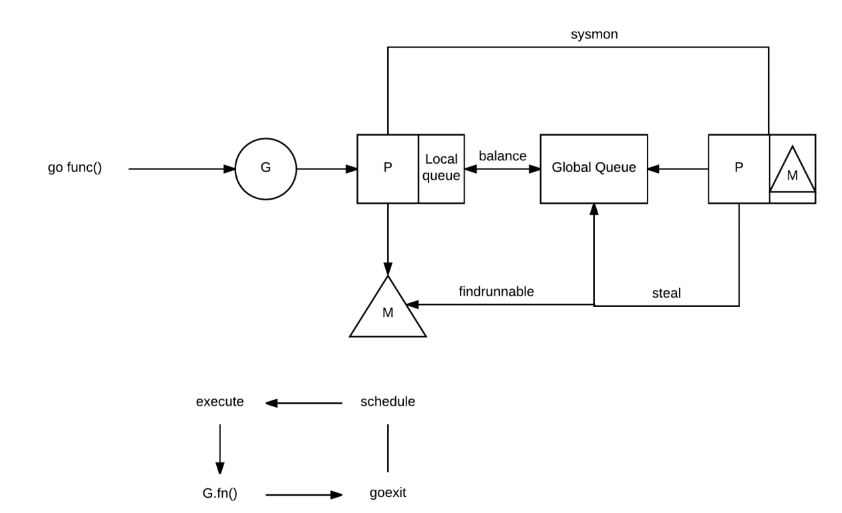

goroutine 是Go语言中一个及其重要的概念，也是提到Go并发，绕不开的知识点

<!--more-->

### goroutine是轻量级的线程（Thread）么

先说结论：不是的。
#### 线程与进程
先简单提一下进程和线程的区别：
* 线程之间共享内存。创建线程时不需要通过MMU（memory management unit）创建虚拟内存
* 由于共享内存，线程之间通信比进程通信方便。

但要注意：Linux系统中并不区分线程和进程，统一叫作任务（task）。

虽然线程已经是轻量级的进程了，但还是有一些问题：
* 创建线程仍然需要消耗大量的栈空间 （每个线程1MB以上）
* 线程需要拥有自己的寄存器资源
* 线程创建和销毁需要操作系统来支持，速度较慢

#### goroutine
goroutine和协程是两个概念，goroutine 并不等于协程，**goroutine 是协程的Go语言的实现**。在这里我们只讨论goroutine。
goroutine存在于golang运行时（runtime）的虚拟空间中，而不是操作系统中。它的生命周期由golang运行时调度器（scheduler）来控制。
golang运行时维护三种C结构体

* G struct： 代表单个go协程，以及它的结构，栈指针，栈底，ID，缓存，状态等
* M struct： 代表操作系统线程。包含一个指向全局可运行协程队列的指针，当前正在运行的协程，以及调度器的引用。
* Sched struct： 全局结构。包含空闲和等待协程的队列

抽象结构（非真实结构体）: P 代表一个Go代码片段所需的资源（上下文环境）

可以通过runtime.GOMAXPROCS 来设置P的大小
程序运行后，go运行时（runtime）为GC，调度器（scheduler），用户代码创建一定数量的goroutines。然后创建一个系统线程（OS Thread）负责控制这些goroutines。线程的数量不能超过GOMAXPROCS

#### M，P，G交互

可以看到，Go运行时存在两种类型的queue： 一种是一个全局的queue(在schedt结构体中，很少用到)， 一种是每个P都维护自己的G的queue。 

为了运行goroutine, M需要持有上下文P。M会从P的queue弹出一个goroutine并执行。 

当你创建一个新的goroutine的时候(go func()方法)，它会被放入P的queue。当然还有一个 work-stealing调度算法，当M执行了一些G后,如果它的queue为空，它会随机的选择另外一个P,从它的queue中取走一半的G到自己的queue中执行。(偷!) 

当你的goroutine执行阻塞的系统调用的时候(syscall)，阻塞的系统调用会中断(intercepted)，如果当前有一些G在执行，运行时会把这个线程从P中摘除(detach)，然后再创建一个新的操作系统的线程(如果没有空闲的线程可用的话)来服务于这个P。 

当系统调用继续的时候，这个goroutine被放入到本地运行queue，线程会park它自己(休眠)， 加入到空闲线程中。 

如果一个goroutine执行网络调用，运行时会做类似的动作。调用会被中断，但是由于Go使用集成的network poller,它有自己的线程，所以还给它。 

### 开始理解goroutine
#### goroutine大小
goroutine创建时只会消耗2KB的栈空间，还会对每个函数调用作优化，判断栈空间是否能复用。
#### 阻塞？没问题
如果一个goroutine由于系统调用（system call）而阻塞，它会阻塞它所在的线程。但是调度队列会取出另一个线程，并运行其他的，可运行的goroutine。
如果你在Go中使用channel进行通信，因为是在虚拟空间里的，操作系统不会阻塞该线程。该goroutine只是处于等待状态，而别的可运行状态的goroutine也不受影响。

#### 非中断
go运行时的调度器是合作性调度（cooperative scheduling），也就是说，当前协程只有在阻塞或者结束时，另一个协程才会被调度，例如：
* channel发送或者接收阻塞型操作
* go 声明
* 阻塞型系统调用，例如文件/网络 IO
* 停止等待GC回收

这样的方式比预先调度（系统定时中断，调度一个新线程）要好。
还有一个优点是，由于是在sleep/channel wait等代码中唤醒，编译只需要对应的寄存器。在Go中，只需要3个寄存器： PC, SP 和 DX (Data Registers)，在上下文切换时进行更新。而不像线程那样需要所有寄存器。
